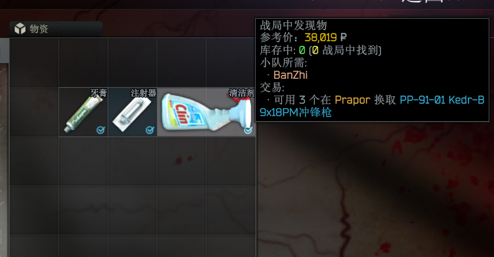

# ItemPurposeCheckmarks

独立任务/用途勾选 Mod，支持 SPT 4.1+（测试环境: 4.1.3）。

## 项目定位

**继承 AllQuestsCheckmarks（AQC, GPL-3.0）的全部能力，并整合 MoreCheckmarks（MCM, GPLv3）的信息维度。**

在 AQC 的勾选/配色体系上，融合 MCM 的独有信息维度（藏身处、交易、制造、愿望单等），让仓库内每个物品一目了然地显示它"有何用途"。

## 功能亮点

- 任务勾选（继承 AQC 全部能力）
- 物品参考价引入
- 藏身处升级材料按设施显示（来自 MCM，`Show hideout upgrade materials` 选项控制）
- 商人名对齐显示（服务端路由 `/item-purpose-checkmarks/trader-names` 提供）

## 效果图




## 技术构成

- **客户端**：BepInEx 插件（`netstandard2.1`）
- **服务端**：SPT 编译型 mod（`net10.0`，SPTushonka 4.1.3）
- **版本**：1.1.0

## 目录结构

```
ItemPurposeCheckmarks/
├─ Client/      客户端工程（BepInEx 插件）
├─ Server/      服务端工程（SPT mod）
├─ ZGCLib/      公共库源码（AQC 作者同名库）
└─ release/     构建产物（隔离输出，不写入游戏目录）
```

## 构建步骤

```bash
# 客户端（若游戏目录非 F:\EFT v4.1，先改 Client.csproj 里的 <SptDir>）
dotnet build Client/Client.csproj -c Release

# 服务端
dotnet build Server/Server.csproj -c Release

# 一键打包
Compress-Archive -Path .\release\* -DestinationPath .\ItemPurposeCheckmarks-manual-install.zip -Force
```

产物永远落在 `release/`，对游戏零侵入，可边开着游戏边 `dotnet build`。

## 如何安装

项目源码提供了已经构建好的产物，无需手动构建。直接将 `release/` 下的文件夹复制到根目录即可。

您也可以在 [Releases](https://github.com/MinLyOo/ItemPurposeCheckmarks/releases) 下载最新版本的手动安装包。

把 `release/` 下两个子文件夹复制到目标目录（保持相对路径）：

| 来源                                                    | 目标                                             |
| ----------------------------------------------------- | ---------------------------------------------- |
| `release/BepInEx/plugins/ItemPurposeCheckmarks`       | `{游戏目录}/BepInEx/plugins/ItemPurposeCheckmarks` |
| `release/SPT_Runtime/user/mods/ItemPurposeCheckmarks` | `{服务器目录}/user/mods/ItemPurposeCheckmarks`      |

卸载 = 删除上述两个文件夹即可，无残留。

为了方便管理Mod，建议您使用如 [SPT Mod Manager](https://github.com/Nevek20/SPT_Mod_Manager) 等Mod管理工具。方便批量安装、卸载、更新等操作，且与游戏目录隔离，无残留。

## 配置入口

- **客户端**：进游戏后按 F12（BepInEx 配置界面）→ ItemPurposeCheckmarks
  - 分组：General / Purpose colors / Colors / Text / Debug
  - F12 界面已汉化，每个信息维度都有独立"显示"开关
- **服务端**：`{mod}/user/mods/ItemPurposeCheckmarks/config.json`
  - `hideInactiveEventQuests`、`excludedQuestIds`（任务 ID 见首次启动生成的 `quest-id-reference.txt`）

## 兼容性

- 与 **AQC**（`zgfuedkx.allquestscheckmarks`）**互斥**，不可共存（服务端 `Incompatibilities` 已声明）
- 与 **MCM** 无冲突
- **Fika**：软依赖。未装 Fika 时自动跳过小队功能，其余功能照常

## 详细文档

完整构建与配置说明见 [BUILD\_AND\_CONFIG.md](./BUILD_AND_CONFIG.md)。


## 免责声明

本融合Mod利用了AI辅助开发，mod虽经过多次测试，但仍可能存在未知Bug、兼容性问题或与未来 SPT 版本的适配缺陷。
建议：
- 使用前确保您已备份存档和服务器数据，以防止任何可能的损失。
- 因使用本 Mod 造成的任何存档损坏、进度丢失或其他损失，恕不承担责任。
- 如遇问题欢迎反馈，但不保证及时修复。

## 致谢

- [AllQuestsCheckmarks](https://github.com/zgfuedkx) — GPL-3.0
- [MoreCheckmarks](https://github.com/TommySoucy) — GPLv3

